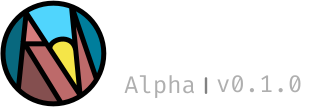

<picture>
  <source media="(prefers-color-scheme: dark)" srcset="./git-assets/LOGO_NAME_DARK.svg" >
  <source media="(prefers-color-scheme: light)" srcset="./git-assets/LOGO_NAME_LIGHT.svg" >

  
</picture>

### This project is still under intital development
#### Docs will be out soon
